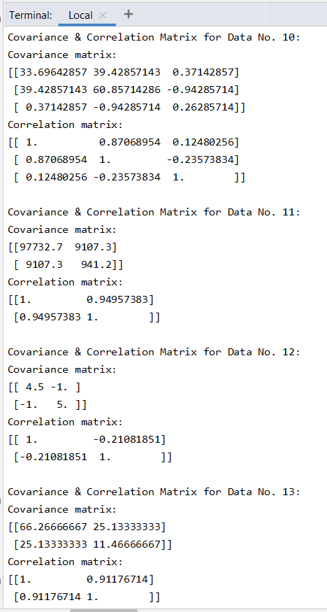

# Deep Learning - Covariance & Correlation Matrices
## Deep Learning Homework 1 No. 10-13 | Indra Imanuel Gunawan - 20195118
This is my solution for homework 1 No. 10-14 of the Deep Learning class. The questions ask to calculate the covariance and correlation matrices of many kinds of data. Each number provides different set of data. This code is implemented using python.

## Setup
Install Numpy\
`pip install numpy`

## Run
To run this code, just type this on the terminal (make sure that the directory & environment is correct):\
`python CovarianceCorrelationMatrix.py`

## Results
Here are the Covariance & Correlation Matrices for each number (No. 10-13). Explanation on how to get these matrices is explained on the "Code Explanation" part.\


## Code Explanation
### Function
This is the function that I made to calculate the Covariance and Correlation Matrices. It takes the data that we want to calculate the matrices of as parameter. These codes follow the steps that I've stated below these codes.
```python
def findCovarianceAndCorrelationMatrix(data):
    mean = []
    #Creating the Mean vector
    for i in range(np.size(data,0)):
        mean.append(np.mean(data[i,:]))
    mean_array = np.array([mean])
    mean_array = np.transpose(mean_array)

    cov_matrix = 0
    for i in range(np.size(data,1)):
        data_row = np.reshape(data[:,i],(np.size(data,0),1)) - mean_array
        data_row_t = np.transpose(data_row)
        matmul = np.matmul(data_row, data_row_t)
        cov_matrix += matmul

    cov_matrix = cov_matrix/(np.size(data,1)-1)
    standardized_matrix = np.linalg.inv(np.sqrt(np.diag(np.diag(cov_matrix))))
    corr_matrix = standardized_matrix.dot(cov_matrix).dot(standardized_matrix)

    print("Covariance matrix:")
    print(cov_matrix)
    print("Correlation matrix:")
    print(corr_matrix)
    print("")
```
Here are the steps to calculate the matrices:
#### Covariance Matrix
1. Create the mean vector. This vector consists of average (mean) of each attribute/variable/column of the data. After that, transpose the vector, so that it'll be easier to use it in calculation.
2. Take each sample/row of the data, and make a vector out of it. Then subtract it by the mean vector.
3. After that, create a new vector which is a transpose of the subtracted sample vector.
4. Do a matrix multiplication of the two vectors, resulting in a square shaped matrix (the dimension depends on the number of attributes/variables, if there are 3 attributes/variables, then it'll be a 3x3 matrix). 
5. Do step 2-4 for all the samples/rows, then sum them all up.
6. Divide the results of step 5 with the number of samples -1 (N-1). The result of that will be the Covariance Matrix.
These steps basically follow this formula:

#### Correlation Matrix
1. From the covariance matrix, create a new matrix which take the shape and diagonal value of the covariance matrix. The diagonal value of covariance matrix is the variance for each attribut/variable. After that, inverse that matrix. We'll call this newly created matrix as "E".
2. The correlation matrix is created from the matrix dot product of E . Covariance Matrix . E, or in written form is like this:

### Putting the data into the function
Because I've already created a function to calculate Covariance and Correlation Matrix, to get the result of each data in each number, I just need to pass that data as a parameter to my function. These are the data for each number and the way I use my function with the data.
```python
#Number 10 (Height, Weight, Grade)
data_no10 = np.array(
    [[170,165,174,169,155,172,166,168],
     [60,55,75,67,49,63,58,61],
     [4.1,3.0,2.8,2.9,3.1,3.6,3.7,4.0]]
)
print("Covariance & Correlation Matrix for Data No. 10:")
findCovarianceAndCorrelationMatrix(data_no10)

#Number 11 (S&P 500, ABC Corp.)
data_no11 = np.array(
    [[1692,1978,1884,2151,2519],
     [68,102,110,112,154]]
)
print("Covariance & Correlation Matrix for Data No. 11:")
findCovarianceAndCorrelationMatrix(data_no11)

#Number 12 (Excelsior Corp. Annual Return (percent) & Adirondack Corp. Annual Return (percent))
data_no12 = np.array(
    [[1,-2,3,0,3],
     [3,2,4,6,0]]
)
print("Covariance & Correlation Matrix for Data No. 12:")
findCovarianceAndCorrelationMatrix(data_no12)

#Number 13 (Temperature, Number of Customers)
data_no13 = np.array(
    [[98,87,90,85,95,75],
    [15,12,10,10,16,7]]
)
print("Covariance & Correlation Matrix for Data No. 13:")
findCovarianceAndCorrelationMatrix(data_no13)
```
